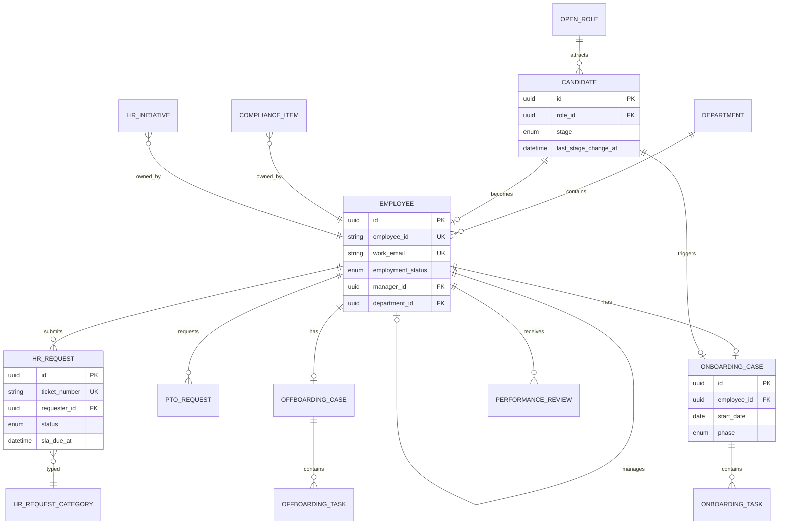

# Monday.com HR CRM Portal — Integration Blueprint

**Version:** 1.0  
**Date:** July 1, 2026  
**Purpose:** Technical and functional blueprint for integrating Monday.com-style HR CRM capabilities into your custom CRM. Hand this document to Cursor (or any dev team) as the single source of truth for scoping, architecture, and implementation.

---

## Table of Contents

1. [Executive Summary](#1-executive-summary)
2. [What Monday.com HR CRM Actually Is](#2-what-mondaycom-hr-crm-actually-is)
3. [Target Architecture for Your CRM](#3-target-architecture-for-your-crm)
4. [Module Breakdown](#4-module-breakdown)
5. [Data Model & Entity Relationships](#5-data-model--entity-relationships)
6. [User Roles & Portals](#6-user-roles--portals)
7. [Workflows & State Machines](#7-workflows--state-machines)
8. [Automation Catalog](#8-automation-catalog)
9. [Dashboards & KPIs](#9-dashboards--kpis)
10. [Cross-Department Integrations](#10-cross-department-integrations)
11. [Monday.com API Sync Layer](#11-mondaycom-api-sync-layer)
12. [UI/UX Blueprint](#12-uiux-blueprint)
13. [Security, Privacy & Compliance](#13-security-privacy--compliance)
14. [Phased Implementation Plan](#14-phased-implementation-plan)
15. [Acceptance Criteria](#15-acceptance-criteria)
16. [Cursor Implementation Prompt](#16-cursor-implementation-prompt)

---

## 1. Executive Summary

Monday.com’s HR offering is **not a traditional HRIS**. It is a **workflow-centric HR operations platform** built on boards (pipelines), automations, employee self-service portals, and dashboards. It excels at:

- Recruitment pipeline visibility
- Cross-functional onboarding coordination
- HR service request ticketing
- Employee directory and lifecycle tracking
- Performance and engagement workflows
- Compliance calendar management

It deliberately **does not** replace payroll, benefits engines, or statutory compliance reporting. Best practice is to use it as the **operational layer** alongside a dedicated HRIS (BambooHR, Workday, Rippling, ADP, etc.).

### What you are building

Replicate Monday.com’s HR CRM **behavior and structure** inside your CRM as a new **HR Operations** product area, with optional **bidirectional sync** to Monday.com if you already use it.

### Design principles (from Monday.com model)

| Principle | Meaning for your CRM |
|-----------|-------------------|
| **Board = workflow container** | Each HR process is a pipeline/board with stages, owners, and SLA |
| **Item = record** | Candidate, employee, request, or task is a first-class entity |
| **Connected records** | Employee Directory is system-of-record for people; other modules link to it |
| **Portal-first intake** | Employees submit requests without full CRM licenses |
| **Automation over memory** | Triggers replace manual email/Slack handoffs |
| **Visibility over spreadsheets** | Dashboards answer workload, SLA, and lifecycle questions |

---

## 2. What Monday.com HR CRM Actually Is

Monday.com packages HR across **three product lines**:

```
┌─────────────────────────────────────────────────────────────────┐
│                    MONDAY.COM HR STACK                          │
├─────────────────┬─────────────────────┬─────────────────────────┤
│  Work Management │      monday CRM     │    monday service       │
│  (core boards)   │  (people as records)│  (employee portal/ESM)  │
├─────────────────┴─────────────────────┴─────────────────────────┤
│  Recruitment → Onboarding → Directory → Performance → Offboarding │
│  HR Requests / Ticketing → Knowledge Base → AI routing            │
└─────────────────────────────────────────────────────────────────┘
                              │
                    Optional HRIS / ATS
              (Workday, BambooHR, Greenhouse, iCIMS)
```

### Core HR capability areas (Monday.com marketing + practitioner structure)

| Area | Monday.com capability |
|------|----------------------|
| **Recruitment** | Applicant tracking, open roles, interview scheduling, quality-of-hire |
| **Onboarding** | Phase-based checklists (pre-boarding → 90 days), cross-dept tasks |
| **Employee wellness & engagement** | Surveys, pulse checks, feedback loops |
| **Performance management** | Review cycles, goals, aggregated feedback |
| **Talent management** | Succession, development plans, training programs |
| **Time management** | PTO/leave requests, approvals |
| **Offboarding** | Access revocation, equipment return, exit interviews |
| **HR service management** | Employee portal, ticketing, SLA, knowledge base, AI agents |

### What Monday.com is NOT (scope boundaries)

Do **not** replicate these in v1 unless you already have them elsewhere:

- Payroll processing
- Benefits enrollment engine
- Tax/statutory compliance filing
- Full HRIS compensation bands and job architecture
- Enterprise-grade performance calibration (use integrations instead)

---

## 3. Target Architecture for Your CRM

### 3.1 High-level system diagram

```
┌──────────────────────────────────────────────────────────────────────┐
│                         YOUR CRM — HR MODULE                         │
├──────────────┬──────────────┬──────────────┬─────────────────────────┤
│  HR Admin    │  Manager     │  Employee    │  Executive              │
│  Console     │  Workspace   │  Portal      │  Dashboard              │
└──────┬───────┴──────┬───────┴──────┬───────┴──────────┬──────────────┘
       │              │              │                  │
       ▼              ▼              ▼                  ▼
┌──────────────────────────────────────────────────────────────────────┐
│                     HR APPLICATION SERVICES                          │
│  Recruitment │ Onboarding │ Directory │ Requests │ PTO │ Performance │
│  Offboarding │ Compliance │ Initiatives │ Documents │ Notifications   │
└──────────────────────────────┬───────────────────────────────────────┘
                               │
       ┌───────────────────────┼───────────────────────┐
       ▼                       ▼                       ▼
┌─────────────┐      ┌─────────────────┐     ┌──────────────────┐
│  HR Database │      │ Workflow Engine  │     │ Integration Hub  │
│  (Postgres)  │      │ (rules + jobs)   │     │ (webhooks, API)  │
└─────────────┘      └─────────────────┘     └────────┬─────────┘
                                                        │
                        ┌───────────────────────────────┼──────────────┐
                        ▼                               ▼              ▼
                 Monday.com API                   HRIS (Workday)   Email/Slack
                 (optional sync)                  ATS (Greenhouse) Calendar/Zoom
```

### 3.2 Workspace structure (mirror Monday.com)

Organize the HR area into **four top-level zones** inside your CRM navigation:

| Zone | Modules | Primary users |
|------|---------|---------------|
| **HR Operations** | Service requests, SLA tracking, knowledge base | HR team, employees (portal) |
| **Employee Lifecycle** | Recruitment, onboarding, directory, offboarding | HR, hiring managers, IT, Finance |
| **Compliance & Governance** | Compliance calendar, policy tracking, audit log | HR, Legal, executives |
| **Strategic Initiatives** | HR projects, engagement surveys, performance cycles | HR leadership, managers |

### 3.3 Recommended tech stack (implementation-neutral)

| Layer | Suggested approach |
|-------|-------------------|
| **API** | REST or GraphQL with OpenAPI spec |
| **Database** | PostgreSQL with row-level security for HR data |
| **Workflow engine** | Event-driven rules (status change → actions) + job queue for scheduled triggers |
| **File storage** | S3-compatible for resumes, offer letters, I-9, policies |
| **Search** | Full-text on employees, candidates, requests |
| **Notifications** | Email + in-app + optional Slack/Teams webhooks |
| **Employee portal** | Separate lightweight auth (SSO) with limited permissions |
| **Audit** | Immutable append-only log for all HR record changes |

---

## 4. Module Breakdown

### 4.1 Employee Directory (foundation — build first)

**Purpose:** Single source of truth for all people records. Every other HR module links here.

**Fields:**

| Field | Type | Required | Notes |
|-------|------|----------|-------|
| `full_name` | string | yes | Display name |
| `work_email` | email | yes | Unique |
| `employee_id` | string | yes | Internal ID |
| `department_id` | FK | yes | |
| `job_title` | string | yes | |
| `manager_id` | FK (self) | no | Org hierarchy |
| `hire_date` | date | yes | |
| `employment_type` | enum | yes | `full_time`, `part_time`, `contractor`, `intern` |
| `work_location` | enum/string | yes | `remote`, `hybrid`, `onsite` + site |
| `employment_status` | enum | yes | `active`, `on_leave`, `terminated`, `pending_start` |
| `phone` | string | no | |
| `photo_url` | string | no | |
| `cost_center` | string | no | Finance sync |
| `monday_item_id` | string | no | If syncing to Monday |

**Views:** Table, org chart, department filter, tenure distribution.

**Connections:** Links to onboarding record, open HR requests, performance reviews, offboarding case.

---

### 4.2 Recruitment Pipeline

**Purpose:** Track open roles and candidates from application to hire.

#### 4.2.1 Open Roles board

| Field | Type |
|-------|------|
| `title` | string |
| `department_id` | FK |
| `hiring_manager_id` | FK (employee) |
| `recruiter_id` | FK (employee) |
| `headcount` | integer |
| `priority` | enum: `low`, `medium`, `high`, `urgent` |
| `status` | enum: `draft`, `open`, `on_hold`, `filled`, `cancelled` |
| `target_start_date` | date |
| `job_description_url` | url |
| `salary_range` | encrypted/rbac | Restricted column |
| `location` | string |

#### 4.2.2 Candidates board

| Field | Type |
|-------|------|
| `full_name` | string |
| `email` | email |
| `phone` | string |
| `role_id` | FK → open_roles |
| `stage` | enum (see workflow) |
| `source` | enum: `linkedin`, `referral`, `indeed`, `inbound`, `agency`, `other` |
| `application_date` | date |
| `last_stage_change_at` | datetime (auto) |
| `recruiter_id` | FK |
| `interview_score` | 1–5 rating |
| `resume_file_id` | FK → files |
| `notes` | rich text |
| `offer_letter_file_id` | FK → files |

**Candidate stages (Status column):**

```
applied → phone_screen → interview → final_round → offer → hired → rejected
                                                              ↘ not_moving_forward
```

**Key automations:**

- Stage → `interview`: notify hiring panel, create calendar hold
- Stage → `offer`: create offer task for HR
- Stage → `hired`: create Employee Directory record (pending), spawn Onboarding pipeline, notify IT/Finance
- Stale candidate alert: no stage change in N days → notify recruiter

---

### 4.3 Onboarding Pipeline

**Purpose:** Coordinate new hire readiness across HR, IT, Facilities, Finance, and hiring manager.

**Parent record:** One onboarding case per new hire, linked to `employee_id`.

| Field | Type |
|-------|------|
| `employee_id` | FK |
| `start_date` | date |
| `phase` | enum: `pre_boarding`, `week_1`, `days_8_30`, `day_30_90`, `complete` |
| `buddy_id` | FK (employee) |
| `hiring_manager_id` | FK |
| `completion_percent` | computed |
| `overall_status` | enum: `not_started`, `in_progress`, `at_risk`, `complete` |

**Sub-tasks (checklist items):**

| Field | Type |
|-------|------|
| `onboarding_id` | FK |
| `title` | string |
| `owner_id` | FK (employee or team) |
| `department` | enum: `hr`, `it`, `facilities`, `finance`, `manager` |
| `due_date` | date |
| `priority` | enum |
| `status` | enum: `todo`, `in_progress`, `blocked`, `done` |
| `documents` | file[] |

**Phase groups (Monday.com groups model):**

1. **Pre-boarding** (days -14 to 0): paperwork, equipment order, account provisioning
2. **Week 1**: orientation, compliance training, team intros
3. **Days 8–30**: role training, first deliverables, check-ins
4. **Days 30–90**: performance baseline, engagement survey, formal close

**Template system:** Maintain reusable task templates per role type (Engineering, Sales, Operations).

**Trigger:** `start_date - 14 days` → auto-create all checklist tasks from template.

---

### 4.4 HR Service Requests (Employee Portal / Ticketing)

**Purpose:** Central intake for all HR questions — replaces Slack DMs and email threads.

This mirrors **monday service** employee portal behavior.

| Field | Type |
|-------|------|
| `ticket_number` | string (auto) |
| `requester_id` | FK (employee) |
| `category` | enum (see below) |
| `subject` | string |
| `description` | rich text |
| `priority` | enum: `low`, `medium`, `high`, `urgent` |
| `status` | enum: `new`, `triaged`, `in_progress`, `waiting_on_employee`, `resolved`, `closed` |
| `assigned_to_id` | FK (HR user) |
| `sla_due_at` | datetime |
| `sla_breached` | boolean (computed) |
| `attachments` | file[] |
| `resolution_notes` | rich text |

**Request categories (with conditional form fields):**

| Category | Follow-up fields |
|----------|-----------------|
| `benefits` | plan type, enrollment period |
| `payroll` | pay period, issue type |
| `onboarding` | start date, hiring manager |
| `pto` | dates, leave type |
| `policy` | policy name |
| `workplace` | location, issue type |
| `performance` | review cycle |
| `other` | — |

**Employee portal features:**

- Submit request via branded web form (no full CRM license required)
- Track request status with ticket number
- Upload supporting documents
- Browse knowledge base articles before submitting

**SLA defaults (configurable):**

| Priority | First response | Resolution |
|----------|---------------|------------|
| urgent | 2 hours | 1 business day |
| high | 4 hours | 2 business days |
| medium | 1 business day | 5 business days |
| low | 2 business days | 10 business days |

---

### 4.5 PTO / Leave Management

| Field | Type |
|-------|------|
| `employee_id` | FK |
| `leave_type` | enum: `vacation`, `sick`, `personal`, `parental`, `bereavement`, `unpaid` |
| `start_date` | date |
| `end_date` | date |
| `hours` | decimal |
| `status` | enum: `pending`, `approved`, `denied`, `cancelled` |
| `approver_id` | FK (manager) |
| `notes` | text |

**Workflow:** Employee submits → manager approves → HR notified → calendar block (optional integration).

---

### 4.6 Performance Reviews

| Field | Type |
|-------|------|
| `employee_id` | FK |
| `review_cycle_id` | FK |
| `reviewer_id` | FK |
| `self_assessment` | rich text |
| `manager_assessment` | rich text |
| `goals` | json[] |
| `rating` | 1–5 or custom scale |
| `status` | enum: `not_started`, `self_review`, `manager_review`, `calibration`, `complete` |

**Cycle entity:** `name`, `start_date`, `end_date`, `participants[]`, `template_id`.

---

### 4.7 Offboarding Checklist

| Field | Type |
|-------|------|
| `employee_id` | FK |
| `last_day` | date |
| `reason` | enum: `resignation`, `termination`, `retirement`, `contract_end` |
| `access_revoked` | boolean |
| `equipment_returned` | boolean |
| `exit_interview_scheduled` | boolean |
| `exit_interview_completed` | boolean |
| `final_pay_notified_finance` | boolean |
| `status` | enum: `initiated`, `in_progress`, `complete` |

**Critical automations:**

- `last_day` entered → notify IT for access revocation
- 7 days before `last_day` → schedule exit interview
- Equipment return reminders every 3 days until complete

---

### 4.8 Compliance Calendar

| Field | Type |
|-------|------|
| `requirement_name` | string |
| `regulation` | string (EEOC, OSHA, ACA, state-specific) |
| `deadline` | date |
| `frequency` | enum: `one_time`, `annual`, `quarterly`, `monthly` |
| `owner_id` | FK |
| `status` | enum: `upcoming`, `in_progress`, `submitted`, `overdue` |
| `evidence_file_id` | FK |

**Alerts:** 30 days, 7 days, and on deadline → escalate to owner + HR director.

---

### 4.9 HR Initiatives & Projects

| Field | Type |
|-------|------|
| `name` | string |
| `owner_id` | FK |
| `timeline_start` | date |
| `timeline_end` | date |
| `budget` | decimal |
| `impact` | text |
| `status` | enum: `planning`, `active`, `on_hold`, `complete` |

Examples: benefits redesign, HRIS migration, DEI program, engagement survey action plan.

---

### 4.10 Knowledge Base (Employee Self-Service)

| Field | Type |
|-------|------|
| `title` | string |
| `category` | enum aligned with request categories |
| `content` | rich text / markdown |
| `visibility` | enum: `all_employees`, `managers_only`, `hr_only` |
| `published` | boolean |
| `updated_at` | datetime |

Portal should surface suggested articles based on request category before ticket submission.

---

## 5. Data Model & Entity Relationships

### 5.1 ER diagram



### 5.2 ID strategy for external sync

| Internal entity | External key (Monday.com) | Sync direction |
|----------------|------------------------|----------------|
| Employee | `monday_item_id` on Directory board | bidirectional |
| Candidate | `monday_item_id` on Candidates board | bidirectional |
| HR Request | `monday_item_id` on Requests board | bidirectional |
| Onboarding task | `monday_subitem_id` | Monday → CRM or CRM → Monday |

Store `sync_origin` (`crm` | `monday` | `hris`) and `last_synced_at` on every syncable record to prevent update loops.

---

## 6. User Roles & Portals

### 6.1 Role matrix

| Capability | HR Admin | HR Specialist | Hiring Manager | Manager | Employee | Executive |
|------------|----------|---------------|----------------|---------|----------|-----------|
| Employee Directory (full) | ✓ | ✓ | team only | team only | self only | read aggregate |
| Recruitment pipeline | ✓ | ✓ | own roles | — | — | dashboards |
| Onboarding management | ✓ | ✓ | own hires | own team | own checklist | dashboards |
| HR requests (assign/resolve) | ✓ | ✓ | — | — | — | — |
| Submit HR request (portal) | ✓ | ✓ | ✓ | ✓ | ✓ | ✓ |
| PTO approve | — | — | — | ✓ | submit | — |
| Performance reviews | ✓ | ✓ | conduct | conduct | self | read aggregate |
| Offboarding | ✓ | ✓ | — | — | — | — |
| Compliance calendar | ✓ | ✓ | — | — | — | read |
| Salary / sensitive fields | ✓ | restricted | — | — | — | — |
| Executive dashboards | ✓ | — | — | — | — | ✓ |

### 6.2 Portal surfaces

| Portal | URL pattern | Auth |
|--------|-------------|------|
| HR Admin Console | `/hr/admin/*` | CRM full auth |
| Manager Workspace | `/hr/team/*` | CRM auth, scoped to reports |
| Employee Self-Service | `/portal/hr/*` | SSO / magic link |
| Executive Dashboard | `/hr/executive` | CRM auth + exec role |

---

## 7. Workflows & State Machines

### 7.1 Candidate pipeline

```
[applied] ──► [phone_screen] ──► [interview] ──► [final_round] ──► [offer]
                                                                    │
                                                    ┌───────────────┼───────────────┐
                                                    ▼               ▼               ▼
                                               [hired]      [not_moving_forward]  [rejected]
                                                    │
                                                    ▼
                                          Create Employee (pending_start)
                                          Spawn Onboarding Case
                                          Notify IT + Finance
```

### 7.2 HR request lifecycle

```
[new] ──► [triaged] ──► [in_progress] ◄──► [waiting_on_employee]
                              │
                              ▼
                         [resolved] ──► [closed]
```

SLA timer starts at `[triaged]` or `[in_progress]` (configurable).

### 7.3 Onboarding phases

```
pre_boarding ──► week_1 ──► days_8_30 ──► day_30_90 ──► complete
```

Phase auto-advances when all tasks in current phase are `done`.

---

## 8. Automation Catalog

Implement these as **workflow rules** in your CRM (priority order for v1):

| # | Trigger | Condition | Actions |
|---|---------|-----------|---------|
| A1 | HR request created | category = X | assign to specialist by category map |
| A2 | HR request → in_progress | — | start SLA timer |
| A3 | SLA breached | status ≠ resolved | notify team lead, set priority = urgent |
| A4 | Candidate stage → hired | — | create employee, onboarding case, IT ticket |
| A5 | Employee start_date - 14d | onboarding not started | create tasks from template |
| A6 | Onboarding task overdue | — | notify owner + hiring manager |
| A7 | Offboarding last_day set | — | notify IT, create offboarding tasks |
| A8 | Compliance deadline - 30d | status ≠ submitted | notify owner |
| A9 | Compliance deadline - 7d | status ≠ submitted | notify owner + HR director |
| A10 | PTO submitted | — | notify manager for approval |
| A11 | Employee status → terminated | — | lock portal access, archive active requests |
| A12 | Weekly cron | — | send HR manager digest of open requests |

### Category → assignee routing map (configurable)

```json
{
  "benefits": "benefits_team",
  "payroll": "payroll_analyst",
  "onboarding": "hr_operations",
  "pto": "hr_operations",
  "policy": "hr_generalist",
  "workplace": "facilities_liaison",
  "performance": "hr_bp",
  "other": "hr_generalist"
}
```

---

## 9. Dashboards & KPIs

### 9.1 HR Operations Dashboard (daily)

| Widget | Metric | Visualization |
|--------|--------|---------------|
| Open requests | count by status | stacked bar |
| Ticket volume | count by week + category | line chart |
| Avg resolution time | hours by category | gauge |
| SLA compliance | % within SLA | battery/progress |
| Workload heatmap | open items per HR user | heatmap table |
| Onboarding funnel | cases by phase | funnel |

### 9.2 Recruitment Dashboard

| Widget | Metric |
|--------|--------|
| Pipeline funnel | candidates per stage |
| Time to fill | days from role open → hired |
| Time in stage | avg days per stage |
| Open roles by dept | bar chart |
| Source effectiveness | hires by source |
| Stale candidates | count with no movement > 14d |

### 9.3 Executive Dashboard

| Widget | Metric |
|--------|--------|
| Headcount by department | with 12-month trend |
| Onboarding completion rate | % cases complete within 90d |
| Time to productivity | avg days to phase complete |
| Compliance status | green/yellow/red by requirement |
| HR initiative progress | % complete |
| Attrition signal | offboarding count vs hires |

---

## 10. Cross-Department Integrations

| Partner system | Events out | Events in |
|----------------|-----------|-----------|
| **IT** | New hire, role change, termination | laptop shipped, access provisioned |
| **Finance** | new hire confirmed, termination | payroll setup complete |
| **Facilities** | new hire, hybrid seat request | desk assigned |
| **ATS (Greenhouse, iCIMS)** | — | new applicant, offer accepted |
| **HRIS (Workday, BambooHR)** | status changes | employee master data |
| **Email/Calendar** | interview scheduled | — |
| **Slack/Teams** | notifications, digest | optional request intake |

Use **connected record pattern**: HR onboarding case shows mirrored IT status without duplicating source data.

---

## 11. Monday.com API Sync Layer

If you use Monday.com today or want optional sync, implement this integration service.

### 11.1 API fundamentals

| Property | Value |
|----------|-------|
| Endpoint | `POST https://api.monday.com/v2` |
| Protocol | GraphQL |
| Auth | `Authorization: <API_TOKEN>` header |
| Products supported | Work Management, CRM, Service (not Workforms) |
| Rate limits | Plan-dependent; use webhooks over polling |

### 11.2 Board → module mapping

| Monday.com board | CRM module | Board ID (configure) |
|------------------|------------|---------------------|
| Employee Directory | `employees` | `MONDAY_BOARD_DIRECTORY` |
| Candidates | `candidates` | `MONDAY_BOARD_CANDIDATES` |
| Open Roles | `open_roles` | `MONDAY_BOARD_ROLES` |
| Onboarding Pipeline | `onboarding_cases` | `MONDAY_BOARD_ONBOARDING` |
| HR Requests | `hr_requests` | `MONDAY_BOARD_REQUESTS` |
| Offboarding | `offboarding_cases` | `MONDAY_BOARD_OFFBOARDING` |
| Compliance Calendar | `compliance_items` | `MONDAY_BOARD_COMPLIANCE` |

### 11.3 Column mapping example (Candidate)

| Monday column | CRM field |
|---------------|-----------|
| Item name | `full_name` |
| Status | `stage` |
| Email | `email` |
| Application Date | `application_date` |
| Person (Recruiter) | `recruiter_id` |
| Rating | `interview_score` |
| Files | `resume_file_id` |
| Connect Boards (Role) | `role_id` |

### 11.4 Webhook events to subscribe

```
create_item
change_column_value
change_status_column_value
create_subitem
change_subitem_column_value
item_deleted
```

**Webhook handler requirements:**

1. Respond to `challenge` token on registration
2. Deduplicate by `triggerUuid` (at-least-once delivery)
3. Fetch full item via GraphQL using `pulseId` from minimal payload
4. Set `sync_origin = monday` before writing to CRM DB
5. Ignore outbound echoes when `sync_origin = crm`

### 11.5 Sample GraphQL mutations

**Create item:**
```graphql
mutation CreateCandidate($boardId: ID!, $name: String!, $cols: JSON!) {
  create_item(board_id: $boardId, item_name: $name, column_values: $cols) {
    id
  }
}
```

**Update status:**
```graphql
mutation UpdateStage($itemId: ID!, $boardId: ID!, $cols: JSON!) {
  change_multiple_column_values(item_id: $itemId, board_id: $boardId, column_values: $cols) {
    id
  }
}
```

**Create webhook:**
```graphql
mutation CreateWebhook($boardId: ID!, $url: String!, $event: WebhookEventType!) {
  create_webhook(board_id: $boardId, url: $url, event: $event) {
    id
  }
}
```

### 11.6 Sync modes

| Mode | Use when |
|------|----------|
| **CRM-native only** | Building HR module from scratch, no Monday license |
| **Monday as source** | HR team already runs on Monday; CRM is reporting layer |
| **Bidirectional** | Both systems actively used; requires conflict resolution |
| **CRM primary + Monday mirror** | Recommended default — CRM owns data, Monday for HR team UI |

---

## 12. UI/UX Blueprint

### 12.1 Navigation structure

```
HR
├── Dashboard
├── People
│   ├── Directory
│   └── Org Chart
├── Talent
│   ├── Open Roles
│   ├── Candidates
│   └── Recruitment Analytics
├── Lifecycle
│   ├── Onboarding
│   ├── Offboarding
│   └── PTO
├── Service
│   ├── Requests (admin)
│   └── Knowledge Base
├── Performance
│   ├── Review Cycles
│   └── My Reviews
├── Compliance
│   └── Calendar
└── Settings
    ├── SLA Rules
    ├── Templates
    ├── Category Routing
    └── Integrations
```

### 12.2 Key screen patterns (Monday.com-inspired)

| Pattern | Description |
|---------|-------------|
| **Kanban board** | Candidates, onboarding phases, HR requests by status |
| **Table view** | Directory, compliance items, open roles |
| **Timeline/Gantt** | Onboarding tasks, HR initiatives |
| **Detail drawer** | Click row → side panel with activity feed, files, linked records |
| **Forms** | Portal request intake with conditional fields |
| **Dashboard** | Widget grid with filters (date range, department) |

### 12.3 Employee portal (minimal UI)

1. **Home:** search knowledge base + "Submit a request" CTA
2. **My requests:** list with status badges
3. **New request:** category picker → dynamic form → confirmation + ticket #
4. **My onboarding:** checklist progress (for new hires)
5. **My PTO:** balance (if tracked) + request form

### 12.4 UX details to match Monday.com quality

- Status columns use color-coded labels
- Inline assignee avatars
- Activity log on every record (who changed what, when)
- @mentions in notes/comments
- File preview for resumes and offer letters
- Empty states with "Create from template" CTA
- Mobile-responsive portal (employees often submit from phone)

---

## 13. Security, Privacy & Compliance

| Requirement | Implementation |
|-------------|----------------|
| RBAC | Role matrix in §6; enforce at API layer |
| Field-level security | Salary, SSN, medical notes restricted to HR Admin |
| Encryption | TLS in transit; AES-256 at rest for PII |
| Audit log | All reads/writes on sensitive entities |
| Data retention | Configurable purge for terminated employees |
| GDPR | Export/delete employee data on request |
| HIPAA (if applicable) | BAA, access controls, separate PHI storage |
| Portal auth | SSO (SAML/OIDC) preferred over passwords |
| File access | Signed URLs with expiration |

**Workspace isolation:** HR data in separate DB schema or tenant partition — never mixed with sales CRM contacts.

---

## 14. Phased Implementation Plan

### Phase 1 — Foundation

**Scope:** Directory, HR Requests, Employee Portal, basic automations A1–A3

**Deliverables:**
- Employee Directory CRUD + org chart
- HR request ticketing with portal intake
- Category-based routing
- SLA tracking
- HR Operations dashboard (basic)
- RBAC for HR Admin vs Employee

**Exit criteria:** Employees can submit and track HR requests; HR can triage and resolve with SLA visibility.

---

### Phase 2 — Employee Lifecycle

**Scope:** Recruitment, Onboarding, Offboarding, cross-dept notifications

**Deliverables:**
- Open Roles + Candidates pipeline (kanban)
- Hire → onboarding automation (A4, A5)
- Onboarding templates by role type
- Offboarding checklist (A7)
- Manager workspace (team view)
- Recruitment dashboard

**Exit criteria:** End-to-end hire flow from candidate to onboarding without manual email handoffs.

---

### Phase 3 — Operations & Compliance

**Scope:** PTO, Compliance Calendar, Knowledge Base, advanced automations

**Deliverables:**
- PTO request + approval workflow
- Compliance calendar with alerts (A8, A9)
- Knowledge base in portal
- Weekly digest (A12)
- Executive dashboard

**Exit criteria:** HR leadership has compliance visibility; employees self-serve common questions.

---

### Phase 4 — Performance & Integrations

**Scope:** Performance reviews, Monday.com sync, HRIS/ATS connectors

**Deliverables:**
- Review cycles + self/manager assessments
- Monday.com sync service (§11)
- HRIS employee import (read-only master data)
- ATS candidate import
- Slack/email notification integrations

**Exit criteria:** Bidirectional sync stable; no update loops; HRIS employee data flows in nightly or on webhook.

---

## 15. Acceptance Criteria

### Module: HR Service Requests
- [ ] Employee can submit request without CRM license via portal
- [ ] Conditional fields appear based on category selection
- [ ] Request auto-routes to correct specialist within 60 seconds
- [ ] SLA timer visible on request detail; breach triggers notification
- [ ] HR admin can filter by status, category, assignee, SLA state
- [ ] Full audit trail on status and assignment changes

### Module: Recruitment
- [ ] Candidate can move through all stages via drag-and-drop kanban
- [ ] Moving to `hired` creates employee + onboarding case automatically
- [ ] Stale candidates (>14d no movement) appear in alert widget
- [ ] Resume upload and preview on candidate record
- [ ] Time-to-fill metric calculates correctly on dashboard

### Module: Onboarding
- [ ] Tasks auto-generated 14 days before start date from role template
- [ ] Phase progress bar updates as tasks complete
- [ ] IT/Finance tasks visible to respective teams (scoped access)
- [ ] Overdue tasks trigger owner + manager notification

### Module: Employee Directory
- [ ] Org chart renders manager hierarchy correctly
- [ ] Single employee links to onboarding, requests, reviews
- [ ] Terminated employees hidden from default views but retained in audit

### Module: Monday.com Sync (if enabled)
- [ ] Webhook challenge verification passes
- [ ] `triggerUuid` deduplication prevents double processing
- [ ] CRM → Monday and Monday → CRM updates complete < 5 seconds
- [ ] No infinite update loops (sync_origin guard)

---

## 16. Cursor Implementation Prompt

Copy the block below into Cursor when you are ready to build:

---

```
Implement the HR CRM module for our application using the blueprint at:
docs/blueprints/monday-hr-crm-integration-blueprint.md

Start with Phase 1 (Foundation):
1. Employee Directory with org chart
2. HR Service Requests with employee portal
3. Category-based auto-routing and SLA tracking
4. HR Operations dashboard
5. RBAC per the role matrix in the blueprint

Technical requirements:
- Follow existing project conventions (stack, folder structure, auth)
- PostgreSQL for HR entities in a dedicated schema: hr
- REST API with OpenAPI documentation
- Event-driven workflow engine for automations A1–A3
- Immutable audit log for all HR entity mutations
- Employee portal at /portal/hr with SSO-compatible auth
- Field-level encryption or RBAC for salary and sensitive data

Data model: implement entities defined in Section 5 (Employee, HRRequest,
Department at minimum for Phase 1).

UI: Monday.com-inspired kanban for requests, table view for directory,
detail drawer with activity feed.

Do not implement payroll, benefits enrollment, or Monday.com sync in Phase 1.
Leave extension points (monday_item_id, sync_origin columns) for Phase 4.

After Phase 1, proceed to Phase 2 per the blueprint unless instructed otherwise.
```

---

## Appendix A — Monday.com HR Template Reference

Official Monday.com templates to study (for UX parity):

| Template | URL |
|----------|-----|
| Recruitment and Onboarding | https://monday.com/templates/template/50352/recruitment-and-onboarding |
| HR landing / feature overview | https://monday.com/lp/aw/hr |
| monday service (employee portal) | https://monday.com/w/service |

## Appendix B — Environment Variables (Phase 4 sync)

```bash
MONDAY_API_TOKEN=
MONDAY_API_URL=https://api.monday.com/v2
MONDAY_BOARD_DIRECTORY=
MONDAY_BOARD_CANDIDATES=
MONDAY_BOARD_ROLES=
MONDAY_BOARD_ONBOARDING=
MONDAY_BOARD_REQUESTS=
MONDAY_WEBHOOK_SECRET=
MONDAY_SYNC_ENABLED=false
```

## Appendix C — API Endpoints (suggested REST surface)

| Method | Path | Description |
|--------|------|-------------|
| GET | `/api/hr/employees` | List/filter directory |
| POST | `/api/hr/employees` | Create employee |
| GET | `/api/hr/employees/:id/org-tree` | Org chart subtree |
| GET | `/api/hr/requests` | List HR tickets (admin) |
| POST | `/api/hr/requests` | Create request |
| PATCH | `/api/hr/requests/:id` | Update status/assignee |
| POST | `/portal/hr/requests` | Portal submission (employee auth) |
| GET | `/portal/hr/requests/:ticketNumber` | Portal status lookup |
| GET | `/api/hr/dashboards/operations` | Operations metrics |
| GET | `/api/hr/candidates` | Recruitment pipeline |
| PATCH | `/api/hr/candidates/:id/stage` | Move candidate stage |
| POST | `/api/hr/onboarding` | Create onboarding case |
| GET | `/api/hr/onboarding/:id/tasks` | Checklist tasks |

---

*End of blueprint. Version 1.0 — ready for Cursor implementation.*
